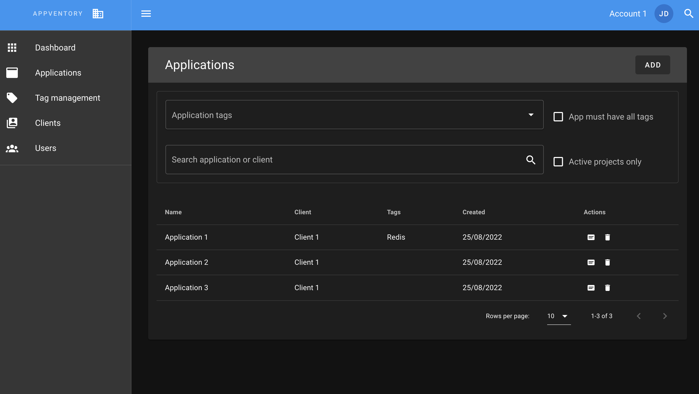
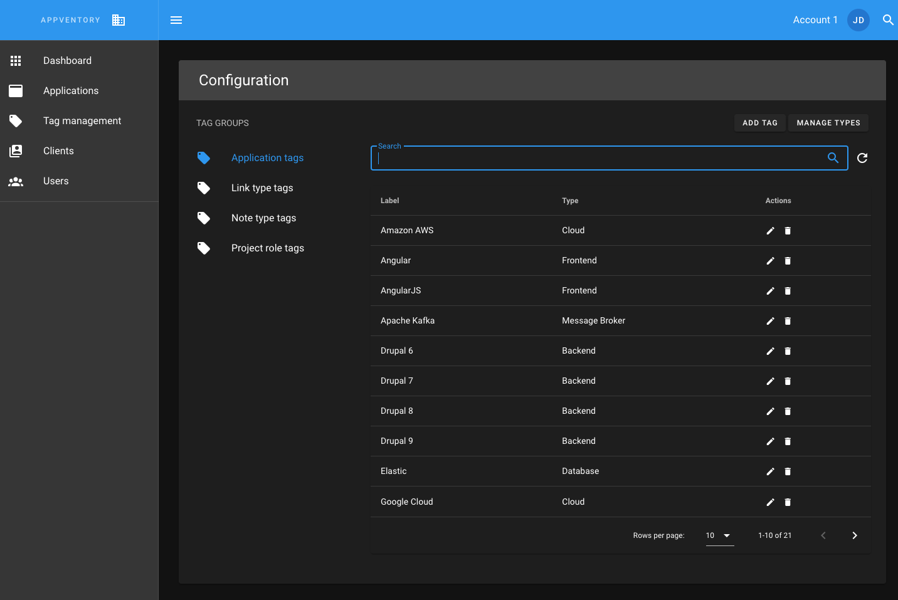

# AppVentory UI - frontend for AppVento.

AppVentory is a tool to manage applications.

Built with [nuxt](https://nuxtjs.org/) and [vuetifyjs](https://vuetifyjs.com/).







## Installation

Add keys
Instal mkcert https://github.com/FiloSottile/mkcert

```bash
mkcert -install
mkcert localhost
```

## Build Setup

```bash
# install dependencies
$ yarn install

# serve with hot reload at localhost:3005
$ yarn dev

# build for production and launch server
$ yarn build
$ yarn start

# generate static project
$ yarn generate
```

Open your browser: https://localhost:3005
